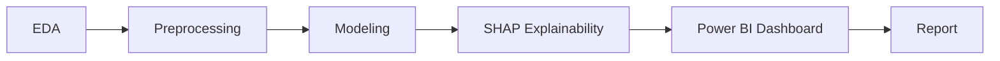
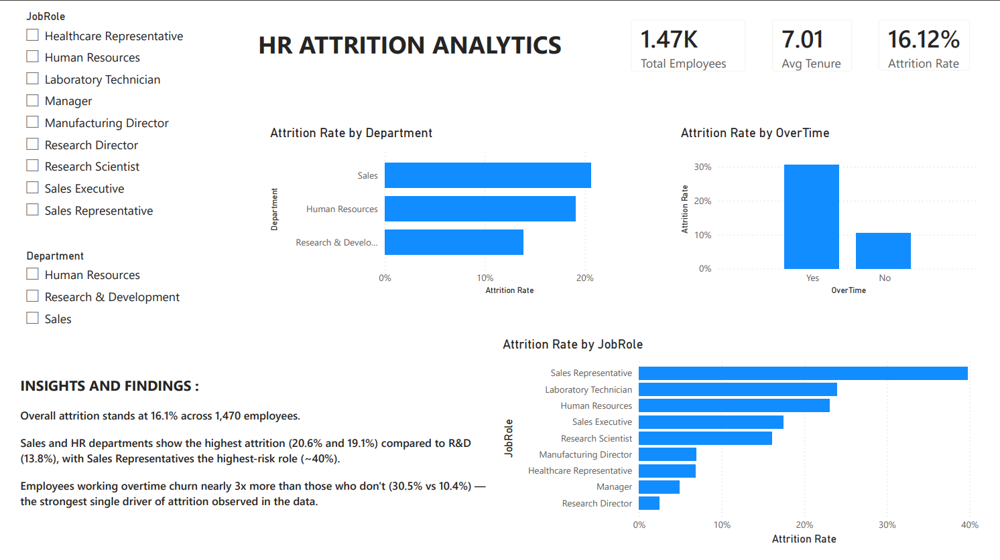
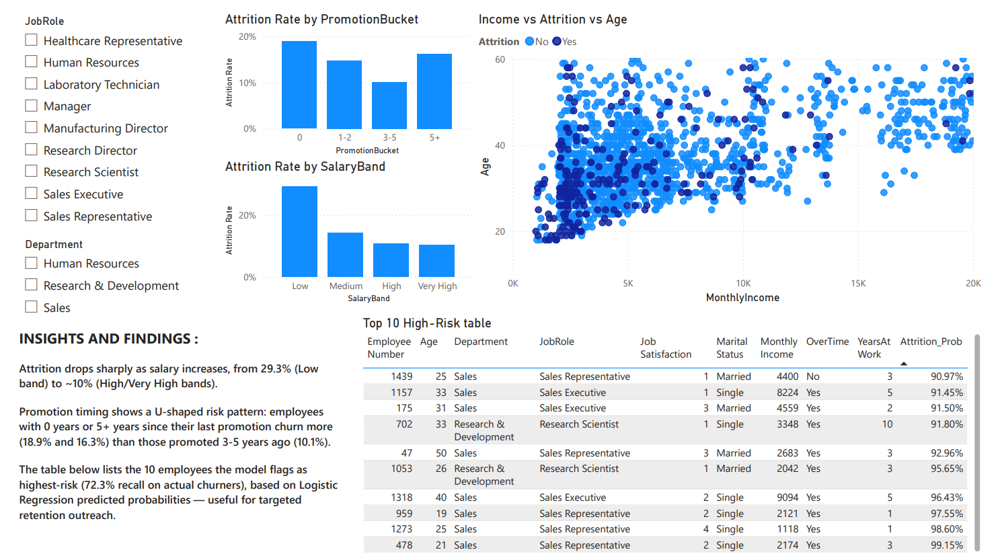

# 📊 HR Attrition Analytics

<div align="center">


**A data analytics project for Elevate Labs Internship** — combining exploratory analysis, classification modeling, SHAP explainability, and an interactive Power BI dashboard to predict and explain employee attrition.

</div>

---

## 📌 Project Overview

Employee attrition costs organizations significantly in recruitment, training, and lost productivity. This project analyzes IBM's HR Analytics dataset (1,470 employees) to:

- 🎯 Predict which employees are likely to resign
- 🔍 Identify the top drivers of attrition using SHAP explainability
- 💡 Deliver actionable HR recommendations backed by data
- 📈 Visualize insights through an interactive Power BI dashboard

---

## 🎯 Key Results

| Metric | Value |
|---|---|
| **Final Model** | Logistic Regression (`class_weight='balanced'`) |
| **Recall** (Attrition=Yes) | **72.3%** |
| **F1-Score** | 0.523 |
| **ROC-AUC** | 0.821 |
| **Accuracy** | 78.9% |

> ⚡ Logistic Regression was selected over Random Forest despite lower accuracy, because it correctly identified **34 of 47 actual churners** (72.3% recall) vs Random Forest's 6.4% — critical since missing a real churner is costlier than a false alarm.

<details>
<summary>📋 <b>Click to view full confusion matrix breakdown</b></summary>

| | Predicted No | Predicted Yes |
|---|---|---|
| **Actual No** | 198 (TN) | 49 (FP) |
| **Actual Yes** | 13 (FN) | 34 (TP) |

</details>

---

## 🔍 Top 3 Attrition Drivers (SHAP)

1. 🕒 **OverTime = Yes**
2. ✈️ **Frequent Business Travel**
3. 📉 **Low Total Working Years** (early-career employees)

---

## 📊 Key EDA Findings

<details open>
<summary><b>Click to expand / collapse findings</b></summary>

| Finding | Insight |
|---|---|
| **OverTime** | 30.5% attrition (Yes) vs 10.4% (No) — nearly 3x gap |
| **Salary Band** | 29.3% (Low) vs 10.3% (Very High) |
| **Promotion Timing** | U-shaped: 18.9% (0 yrs) → 10.1% (3–5 yrs) → 16.3% (5+ yrs) |
| **JobRole** | Sales Representatives churn highest (~40%) |
| **Department** | Sales (20.6%) & HR (19.1%) > R&D (13.8%) |
| **Marital Status** | Single (25.5%) vs Married (12.4%) vs Divorced (10.1%) |
| **Job Satisfaction** | Decreases from 22.8% (level 1) to 11.3% (level 4) |

</details>

---

## 🛠️ Tools & Tech Stack

<div align="center">

| Category | Tools |
|---|---|
| **Language** | Python |
| **Data Analysis** | Pandas, NumPy |
| **Visualization** | Seaborn, Matplotlib |
| **Modeling** | Scikit-learn |
| **Explainability** | SHAP |
| **BI Dashboard** | Power BI |
| **Environment** | Jupyter Notebook |

</div>

---
---

## 🧭 Methodology



1. **EDA** — Univariate/bivariate analysis, salary-band and promotion-trend bucketing, class imbalance check (84% No / 16% Yes)
2. **Preprocessing** — One-hot encoding, 80/20 stratified split, class-weighted balancing
3. **Modeling** — Logistic Regression vs Random Forest, evaluated on Recall/F1 (not just accuracy, given imbalance)
4. **Explainability** — SHAP summary (global) + force plots (individual high-risk employees)
5. **Dashboard** — KPIs, attrition breakdowns by department/role/salary/promotion, high-risk employee table, interactive slicers

---

## 📈 Dashboard Preview

<div align="center">

| Page 1: Overview | Page 2: Drivers & High-Risk |
|---|---|
|  |  |

</div>

---

## 💡 HR Recommendations

- ✅ **Cap/monitor overtime** for high-risk roles (Sales Representatives, Sales Executives) — OverTime employees churn ~3x more.
- ✅ **Reduce frequent business travel burden** or offer compensating support for travel-heavy roles.
- ✅ **Strengthen early-career retention programs** (mentorship, structured check-ins) for low-tenure employees.

---

## 🚀 How to Run

```bash
# Clone the repo
git clone <your-repo-url>
cd HR_ATTRITION

# Install dependencies
pip install pandas seaborn matplotlib scikit-learn shap

# Launch notebook
jupyter notebook notebooks/attrition_analysis.ipynb
```

Open the Power BI dashboard file in **Power BI Desktop** to explore the interactive dashboard.

---

## 📄 Dataset

[IBM HR Analytics Employee Attrition & Performance](https://www.kaggle.com/datasets/pavansubhash/ibm-hr-analytics-attrition-dataset) — 1,470 employees, 35 features.

---

## 👤 Author

**Thomas Aldo** — Data Analyst Intern, Elevate Labs

[](www.linkedin.com/in/thomas-aldo)
[](https://github.com/ThomasAldo)

---

<div align="center">

⭐ **If you found this project useful, consider giving it a star!** ⭐

</div>


